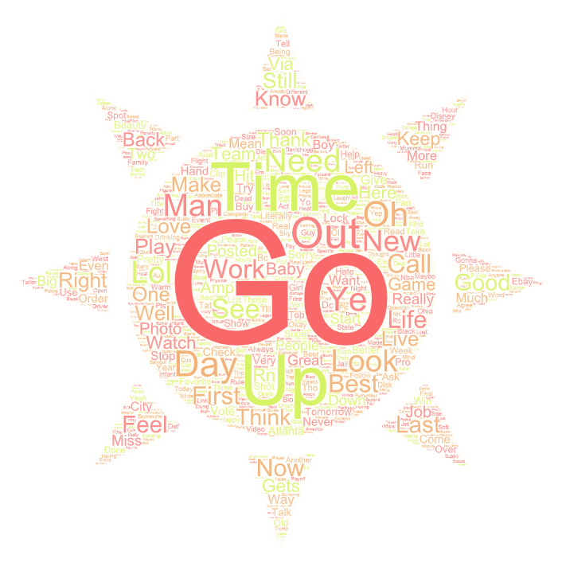

# lab2geog458

This project uses maps and word clouds to compare tweets from different times. I became interested in the subject of time zones after having recently followed a television show where contestants’ fate in the competition is decided by viewers’ votes. The show aired at 8pm for both the East and West Coast while the voting period was only open from 8pm to 10pm ET. As a result, West Coast audiences watched a recorded version of the live show and if they wanted to vote, they had to vote before even watching the episode. The choice to air the show at the same time across time zones made me wonder how it would impact votes and the success of contestants from more eastern states. With this curiosity, I choose to look at tweets from the late afternoon and from the night relative to Pacific Time. 

The first map shows the distribution of tweets taken from late afternoon. With the points representing tweets, the majority of distinguishable tweets appear to fall east of Texas with expected clusters around major cities like Los Angeles, Chicago, Dallas, New York, and Boston. The second map show tweets taken from late at night Pacific Time and very early morning on the East Coast. It would appear that in the second map there is a greater number of tweets from the West Coast than before and at least four tweets from Hawaii and Alaska. There also appears to be less tweets from the Midwest later in the night. The distribution of tweets could arguably be impacted by the different time zones where the further east people are for the given time, the more likely they are to be asleep and not be tweeting. It would be interesting to see a timelapse of similar data and perhaps see a shift to the East Coast when it becomes morning over there. 

The first word cloud shows words found in tweets from late afternoon and the second shows that from later at night. The time of day likely impacts the subjects people tweet about and therefore the words that appear in the clouds. For example, during the day people are working or are pressed for time, which would explain why 'time' and 'work' are larger for the afternoon tweets than that for the night tweets. On the other hand, words like 'sleep' and 'watch' appear larger for night tweets than in the day distribution. At night, people are more likely to be watching television or are about to go to bed. The words and their sizes could give insight into how people’s actions vary based on the time of day. 
